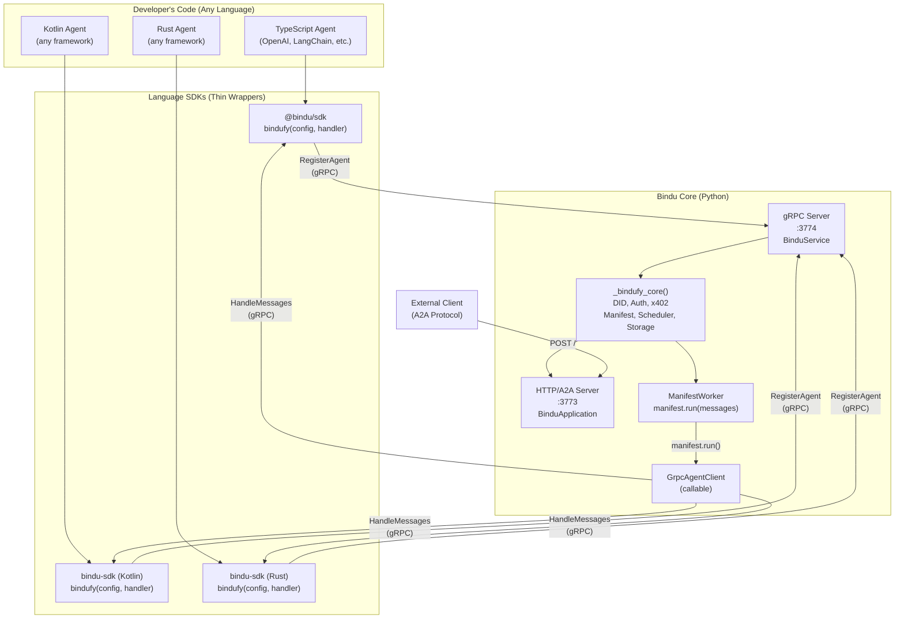
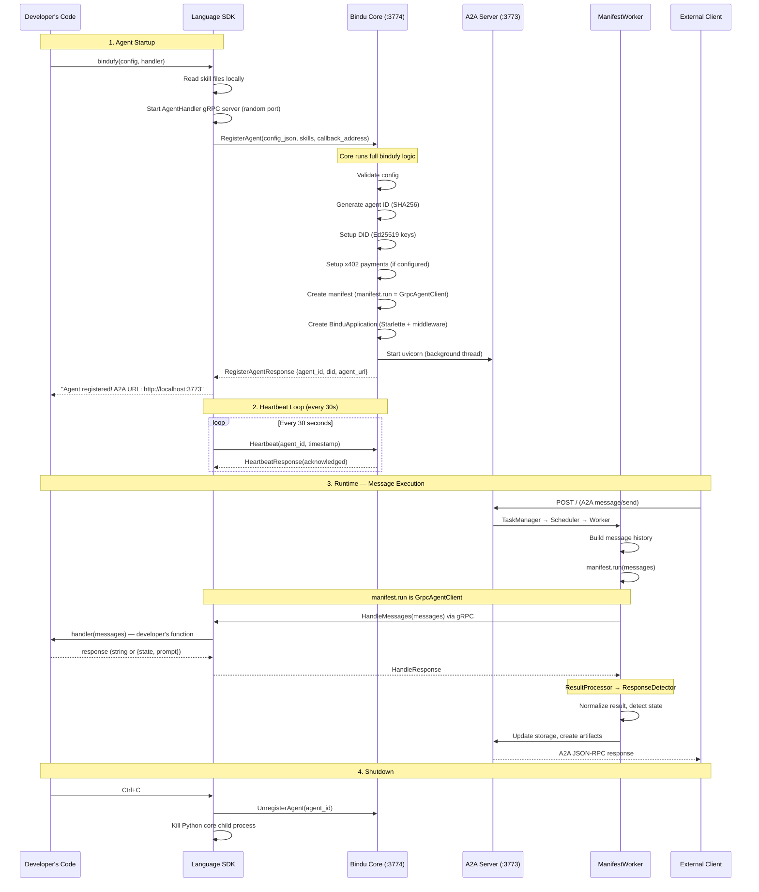
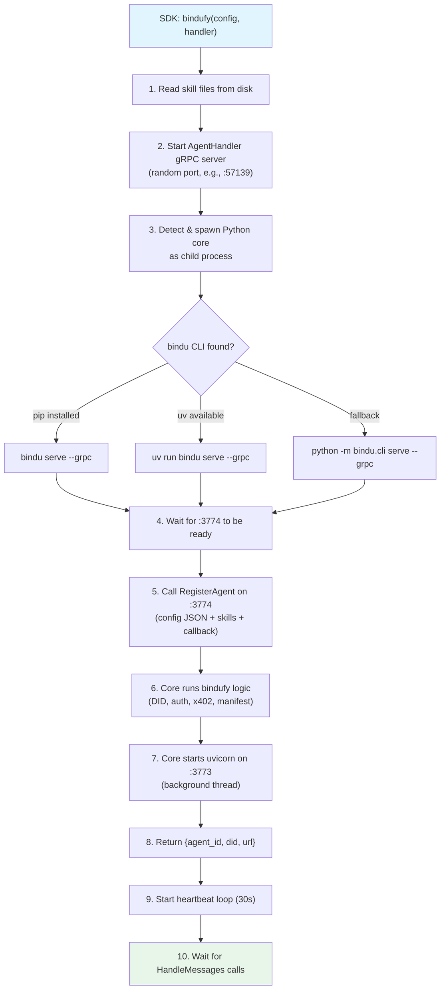

# gRPC Language-Agnostic Agent Support

Bindu's gRPC adapter enables agents written in **any programming language** — TypeScript, Kotlin, Rust, Go, or any language with gRPC support — to transform themselves into full Bindu microservices with DID identity, A2A protocol, x402 payments, scheduling, and storage.

The gRPC layer is the bridge between the language-agnostic developer world and the Python-powered Bindu core. Developers call `bindufy()` from their language SDK, and the gRPC adapter handles everything behind the scenes.

## Architecture Overview



## Two gRPC Services

The gRPC adapter defines **two services** in a single proto file (`proto/agent_handler.proto`):

### 1. BinduService (Core Side — Port 3774)

SDKs call this service on the Bindu core to register agents and manage their lifecycle.

| RPC Method | Direction | Purpose |
|-----------|-----------|---------|
| `RegisterAgent` | SDK → Core | Register an agent with full config, skills, and callback address. Core runs bindufy logic (DID, auth, x402, manifest, HTTP server). |
| `Heartbeat` | SDK → Core | Periodic keep-alive signal (every 30s). Core tracks agent liveness. |
| `UnregisterAgent` | SDK → Core | Disconnect and clean up. Core stops the agent's HTTP server. |

### 2. AgentHandler (SDK Side — Dynamic Port)

The core calls this service on the SDK whenever a task needs to be executed.

| RPC Method | Direction | Purpose |
|-----------|-----------|---------|
| `HandleMessages` | Core → SDK | Execute the developer's handler with conversation history. This is called every time an A2A request arrives. |
| `HandleMessagesStream` | Core → SDK | Same as HandleMessages but with server-side streaming (proto-defined, implementation pending). |
| `GetCapabilities` | Core → SDK | Query what the agent supports (skills, streaming, etc.). |
| `HealthCheck` | Core → SDK | Verify the SDK process is responsive. |

## Complete Message Flow



## GrpcAgentClient — The Core Bridge

`GrpcAgentClient` is the key component that makes gRPC transparent to the rest of the Bindu core. It is a **callable class** that replaces `manifest.run` for remote agents.

### How it works

In `ManifestWorker.run_task()` (line 171 of `manifest_worker.py`):

```python
raw_results = self.manifest.run(message_history or [])
```

For a **Python agent**, `manifest.run` is a direct Python function call.

For a **remote agent** (TypeScript, Kotlin, etc.), `manifest.run` is a `GrpcAgentClient` instance. When called, it:

1. Converts `list[dict[str, str]]` → proto `ChatMessage` objects
2. Calls `AgentHandler.HandleMessages` on the SDK via gRPC
3. Converts the proto `HandleResponse` back to `str` or `dict`
4. Returns the result to ManifestWorker

### Response format contract

The GrpcAgentClient returns exactly what `ResultProcessor` and `ResponseDetector` expect:

| SDK returns | GrpcAgentClient returns | Task state |
|------------|------------------------|------------|
| Plain string (`"Hello"`) | `str` → `"Hello"` | `completed` |
| `{state: "input-required", prompt: "Clarify?"}` | `dict` → `{"state": "input-required", "prompt": "Clarify?"}` | `input-required` |
| `{state: "auth-required"}` | `dict` → `{"state": "auth-required"}` | `auth-required` |

This means **zero changes** to ManifestWorker, ResultProcessor, ResponseDetector, or any downstream component. They cannot tell the difference between a local Python handler and a remote gRPC handler.

## Proto Definition

The full proto file is at `proto/agent_handler.proto`. Key design decisions:

### Config sent as JSON

```protobuf
message RegisterAgentRequest {
  string config_json = 1;  // Full config as JSON string
  repeated SkillDefinition skills = 2;
  string grpc_callback_address = 3;
}
```

The config is sent as a JSON string rather than typed proto fields. This means:
- Adding new config fields to `bindufy()` does **not** require proto changes
- Config validation happens once, in the Python core (`ConfigValidator`)
- SDKs define their own typed config interfaces that serialize to JSON
- **DRY principle**: config schema lives in one place (Python)

### Skills sent with content

```protobuf
message SkillDefinition {
  string name = 1;
  string description = 2;
  repeated string tags = 3;
  string raw_content = 8;  // Full skill.yaml/SKILL.md content
  string format = 9;       // "yaml" or "markdown"
}
```

The SDK reads skill files from the developer's filesystem and sends the content in the proto. The core processes skills without needing filesystem access to the SDK's project directory.

### Response state handling

```protobuf
message HandleResponse {
  string content = 1;
  string state = 2;    // "", "input-required", "auth-required"
  string prompt = 3;
  bool is_final = 4;
  map<string, string> metadata = 5;
}
```

When `state` is empty, the response is a normal completion. When `state` is set, it triggers a task state transition — the task stays open for follow-up messages.

## SDK Developer Experience

The gRPC layer is completely invisible to the developer. All SDKs expose the same `bindufy(config, handler)` function:

### TypeScript

```typescript
import { bindufy, ChatMessage } from "@bindu/sdk";
import OpenAI from "openai";

const openai = new OpenAI();

bindufy({
  author: "dev@example.com",
  name: "my-agent",
  deployment: { url: "http://localhost:3773", expose: true },
  skills: ["skills/question-answering"],
}, async (messages: ChatMessage[]) => {
  const response = await openai.chat.completions.create({
    model: "gpt-4o",
    messages: messages.map(m => ({
      role: m.role as "user" | "assistant" | "system",
      content: m.content,
    })),
  });
  return response.choices[0].message.content || "";
});
```

### Kotlin

```kotlin
import com.getbindu.sdk.bindufy

fun main() {
    bindufy(
        config = mapOf(
            "author" to "dev@example.com",
            "name" to "my-agent",
            "deployment" to mapOf("url" to "http://localhost:3773"),
        )
    ) { messages ->
        "Echo: ${messages.last().content}"
    }
}
```

### Python (unchanged)

```python
from bindu.penguin.bindufy import bindufy

def handler(messages):
    return my_agent.run(messages)

bindufy(config, handler)  # No gRPC — direct in-process call
```

## SDK Internal Flow

When a developer calls `bindufy()` from a language SDK, this is what happens inside:



## Configuration

### Environment Variables

| Variable | Default | Description |
|----------|---------|-------------|
| `GRPC__ENABLED` | `false` | Enable gRPC server (set automatically by `bindu serve --grpc`) |
| `GRPC__HOST` | `0.0.0.0` | gRPC server bind host |
| `GRPC__PORT` | `3774` | gRPC server port |
| `GRPC__MAX_WORKERS` | `10` | Thread pool size for gRPC server |
| `GRPC__MAX_MESSAGE_LENGTH` | `4194304` | Max gRPC message size (4MB) |
| `GRPC__HANDLER_TIMEOUT` | `30.0` | Timeout for HandleMessages calls (seconds) |
| `GRPC__HEALTH_CHECK_INTERVAL` | `30` | Health check interval (seconds) |

### Python Settings

```python
from bindu.settings import app_settings

# Access gRPC settings
app_settings.grpc.enabled     # bool
app_settings.grpc.host         # str
app_settings.grpc.port         # int
app_settings.grpc.max_workers  # int
```

## Port Layout

```
Bindu Core Process
├── :3773  Uvicorn (HTTP)  — A2A protocol, agent card, DID, health, x402, metrics
└── :3774  gRPC Server     — RegisterAgent, Heartbeat, UnregisterAgent

SDK Process
└── :XXXXX  gRPC Server (dynamic port) — HandleMessages, GetCapabilities, HealthCheck
```

## Agent Registry

The core maintains a thread-safe in-memory registry of connected SDK agents:

```python
from bindu.grpc.registry import AgentRegistry

registry = AgentRegistry()

# After RegisterAgent
registry.register(agent_id, callback_address, manifest)

# Lookup
entry = registry.get(agent_id)
# entry.agent_id, entry.grpc_callback_address, entry.manifest,
# entry.registered_at, entry.last_heartbeat

# Heartbeat update
registry.update_heartbeat(agent_id)

# List all connected agents
agents = registry.list_agents()

# Cleanup
registry.unregister(agent_id)
```

## Testing gRPC with Postman

### Setup

1. Open Postman → **New** → **gRPC**
2. Enter URL: `localhost:3774`
3. Import proto: `proto/agent_handler.proto`

### Test Heartbeat

- Service: `bindu.grpc.BinduService`
- Method: `Heartbeat`
- Body:
```json
{
  "agent_id": "test-123",
  "timestamp": 1711234567890
}
```

### Test RegisterAgent

- Method: `RegisterAgent`
- Body:
```json
{
  "config_json": "{\"author\":\"test@example.com\",\"name\":\"postman-agent\",\"description\":\"Test\",\"deployment\":{\"url\":\"http://localhost:3773\",\"expose\":true}}",
  "skills": [],
  "grpc_callback_address": "localhost:50052"
}
```

> Note: RegisterAgent will fail unless an AgentHandler server is running on the callback address. Use the TypeScript SDK or a gRPC mock to provide one.

## File Structure

```
proto/
  agent_handler.proto              # Single source of truth for the gRPC contract

bindu/grpc/
  __init__.py                      # Package exports
  generated/                       # protoc output (Python stubs)
    agent_handler_pb2.py
    agent_handler_pb2_grpc.py
    agent_handler_pb2.pyi
  client.py                        # GrpcAgentClient (core → SDK callable)
  server.py                        # gRPC server startup
  service.py                       # BinduServiceImpl (handles RegisterAgent)
  registry.py                      # Thread-safe agent registry

bindu/cli/
  __init__.py                      # `bindu serve --grpc` command

sdks/
  typescript/                      # @bindu/sdk npm package
    src/
      index.ts                     # bindufy() function
      server.ts                    # AgentHandler gRPC server
      client.ts                    # BinduService gRPC client
      core-launcher.ts             # Spawns Python core as child process
      types.ts                     # TypeScript interfaces
    proto/
      agent_handler.proto          # Copy of proto for npm packaging

  kotlin/                          # bindu-sdk Gradle package
    src/main/kotlin/com/getbindu/sdk/
      BinduAgent.kt                # bindufy() function
      Server.kt                    # AgentHandler gRPC server
      Client.kt                    # BinduService gRPC client
      CoreLauncher.kt              # Spawns Python core as child process

scripts/
  generate_protos.sh               # Generates stubs for all languages
```

## Extending to New Languages

To add support for a new language (e.g., Go, Rust, Swift):

1. **Generate stubs** from `proto/agent_handler.proto` using the language's protoc plugin
2. **Implement AgentHandler service** — receives `HandleMessages` calls, invokes the developer's handler
3. **Implement BinduService client** — calls `RegisterAgent` on core port 3774
4. **Implement CoreLauncher** — spawns `bindu serve --grpc` as a child process
5. **Expose `bindufy(config, handler)`** — the developer-facing API

The SDK should be ~200-400 lines. The proto contract is the single source of truth — as long as the SDK speaks the same proto, it works with any version of the Bindu core.

## Backward Compatibility

- **Python agents are unaffected.** `bindufy(config, handler)` works exactly as before — no gRPC, no second process, direct in-process handler call.
- **gRPC is opt-in.** The gRPC server only starts when `bindu serve --grpc` is called or when a language SDK spawns the core.
- **Proto evolution.** The proto uses proto3 with optional fields. New fields can be added without breaking existing SDKs. Field numbers are never reused.
