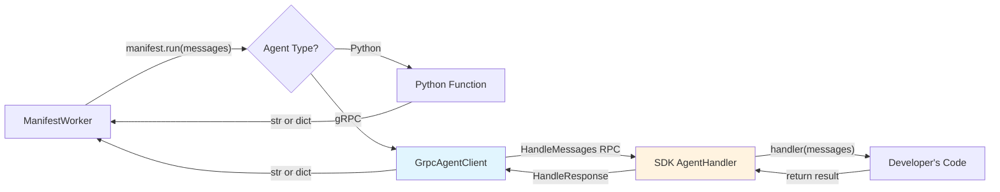

# GrpcAgentClient

The `GrpcAgentClient` is the bridge that makes gRPC transparent to the Bindu core. It's a **callable class** that replaces `manifest.run` for remote agents.

## Visual Overview



## How It Works

In `ManifestWorker.run_task()` at line 171 of `manifest_worker.py`:

```python
raw_results = self.manifest.run(message_history or [])
```

- **Python agent**: `manifest.run` is a direct Python function call
- **Remote agent**: `manifest.run` is a `GrpcAgentClient` instance

When called, `GrpcAgentClient`:

1. Converts `list[dict[str, str]]` → proto `ChatMessage` objects
2. Calls `AgentHandler.HandleMessages` on the SDK via gRPC
3. Converts proto `HandleResponse` back to `str` or `dict`
4. Returns result to ManifestWorker

## Implementation

### Location
`bindu/grpc/client.py`

### Class Definition

```python
class GrpcAgentClient:
    """Callable gRPC client that acts as manifest.run for remote agents."""
    
    def __init__(self, callback_address: str, timeout: float = 30.0):
        """Initialize the gRPC agent client.
        
        Args:
            callback_address: SDK's AgentHandler gRPC server address
                (e.g., "localhost:50052")
            timeout: Timeout in seconds for HandleMessages calls
        """
        self._address = callback_address
        self._timeout = timeout
        self._channel: grpc.Channel | None = None
        self._stub: agent_handler_pb2_grpc.AgentHandlerStub | None = None
```

### Key Methods

#### `__call__(messages, **kwargs)` - Execute Handler

The main method called by ManifestWorker:

```python
def __call__(
    self, messages: list[dict[str, str]], **kwargs: Any
) -> str | dict[str, Any]:
    """Execute the remote handler with conversation history.
    
    Args:
        messages: Conversation history as list of dicts.
            Each dict has "role" (str) and "content" (str) keys.
        **kwargs: Additional keyword arguments (ignored).
    
    Returns:
        str: Plain text response (maps to "completed" task state)
        dict: Structured response with "state" key for state transitions
    """
```

**Implementation:**
1. Lazy-connects to SDK's gRPC server
2. Converts messages to proto format
3. Calls `HandleMessages` RPC
4. Converts response back to Python types

#### `health_check()` - Verify SDK is Alive

```python
def health_check(self) -> bool:
    """Check if the remote SDK agent is healthy.
    
    Returns:
        True if agent responds and reports healthy, False otherwise.
    """
```

#### `get_capabilities()` - Query Agent Info

```python
def get_capabilities(self) -> agent_handler_pb2.GetCapabilitiesResponse | None:
    """Query the remote SDK agent's capabilities.
    
    Returns:
        GetCapabilitiesResponse if successful, None on failure.
    """
```

#### `close()` - Cleanup

```python
def close(self) -> None:
    """Close the gRPC channel and release resources."""
```

## Response Format Contract

The client returns exactly what `ResultProcessor` and `ResponseDetector` expect:

| SDK Returns | GrpcAgentClient Returns | Task State |
|------------|------------------------|------------|
| Plain string `"Hello"` | `str` → `"Hello"` | `completed` |
| `{state: "input-required", prompt: "Clarify?"}` | `dict` → `{"state": "input-required", "prompt": "Clarify?"}` | `input-required` |
| `{state: "auth-required"}` | `dict` → `{"state": "auth-required"}` | `auth-required` |

This means **zero changes** to:
- ManifestWorker
- ResultProcessor
- ResponseDetector
- Any downstream component

They cannot tell the difference between a local Python handler and a remote gRPC handler.

## Usage Example

```python
from bindu.grpc.client import GrpcAgentClient

# Create client pointing to SDK's AgentHandler server
client = GrpcAgentClient(callback_address="localhost:50052", timeout=30.0)

# Call it like a normal function
messages = [
    {"role": "user", "content": "Hello"},
    {"role": "agent", "content": "Hi there!"},
    {"role": "user", "content": "What's the weather?"}
]

result = client(messages)
# result is either str or dict, depending on SDK's response

# Health check
if client.health_check():
    print("SDK is healthy")

# Get capabilities
caps = client.get_capabilities()
if caps:
    print(f"Agent: {caps.name}, Version: {caps.version}")
    print(f"Supports streaming: {caps.supports_streaming}")

# Cleanup
client.close()
```

## Current Limitations

### ❌ Streaming Not Implemented

While `HandleMessagesStream` is defined in the proto, `GrpcAgentClient` does **not** implement it.

**Missing:**
- No method to call `HandleMessagesStream`
- No way to handle streaming responses
- Remote agents cannot yield incremental results

**Impact:**
- `message/stream` A2A endpoint won't work with gRPC agents
- SDKs can only return complete responses
- No support for real-time streaming use cases

**Workaround:**
Use unary `HandleMessages` for now. Streaming support is planned for a future release.

## Thread Safety

The client uses lazy connection initialization:
- Channel and stub are created on first use
- Safe for single-threaded use (ManifestWorker runs tasks sequentially)
- Not thread-safe for concurrent calls from multiple threads

## Error Handling

```python
try:
    result = client(messages)
except grpc.RpcError as e:
    # gRPC call failed
    # ManifestWorker catches this and calls _handle_task_failure
    logger.error(f"gRPC call failed: {e}")
```

Common errors:
- `UNAVAILABLE`: SDK server is down
- `DEADLINE_EXCEEDED`: Handler took longer than timeout
- `CANCELLED`: Request was cancelled
- `UNKNOWN`: SDK handler raised an exception

## Integration with Bindufy

When an agent registers via gRPC:

```python
# In bindu/grpc/service.py (BinduServiceImpl.RegisterAgent)

# Create GrpcAgentClient pointing to SDK
client = GrpcAgentClient(
    callback_address=request.grpc_callback_address,
    timeout=app_settings.grpc.handler_timeout
)

# Create manifest with client as the handler
manifest = AgentManifest(
    # ... other fields ...
    run=client  # This is the key!
)

# When ManifestWorker calls manifest.run(messages),
# it's actually calling client(messages)
```

## Configuration

Controlled by `app_settings.grpc`:

```python
from bindu.settings import app_settings

# Timeout for HandleMessages calls
timeout = app_settings.grpc.handler_timeout  # Default: 30.0 seconds

# Max message size
max_size = app_settings.grpc.max_message_length  # Default: 4MB
```

## Comparison: Python vs gRPC Agents

| Aspect | Python Agent | gRPC Agent |
|--------|-------------|------------|
| `manifest.run` | Python function | `GrpcAgentClient` instance |
| Execution | In-process | Cross-process via gRPC |
| Language | Python only | Any language |
| Latency | ~0ms | ~1-5ms (gRPC overhead) |
| Streaming | ✅ Supported | ❌ Not implemented |
| Debugging | Direct Python debugger | Requires gRPC debugging tools |
