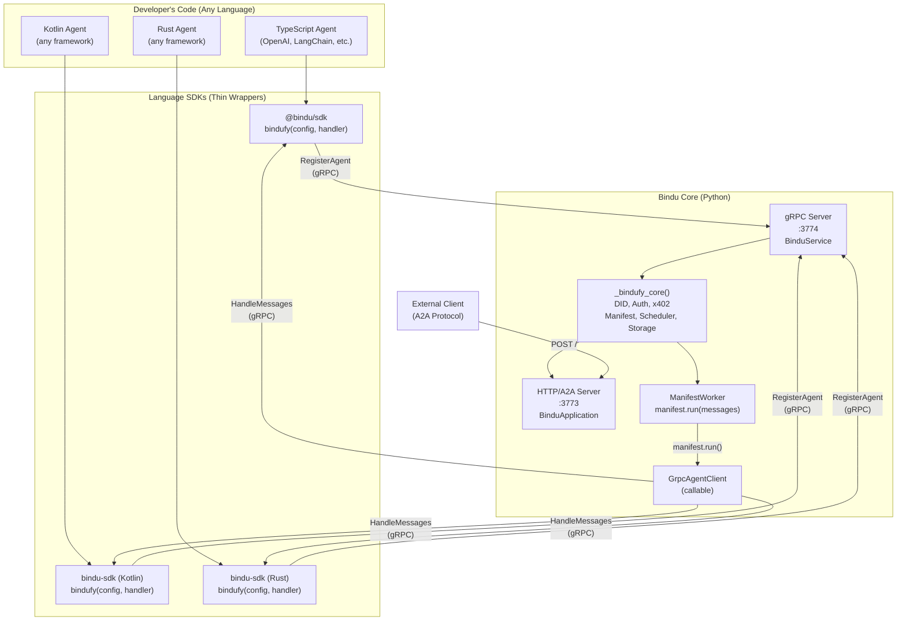
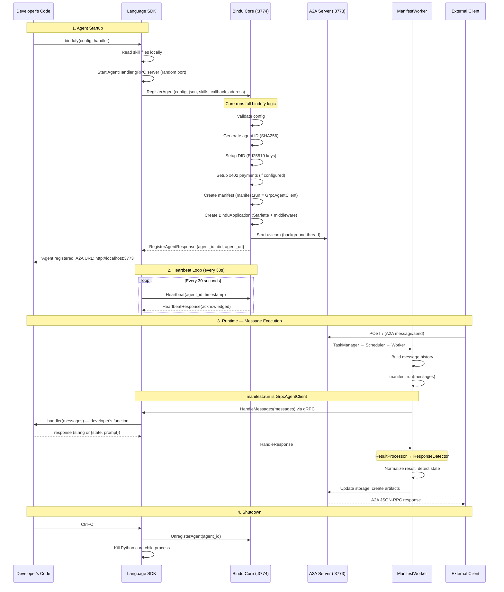
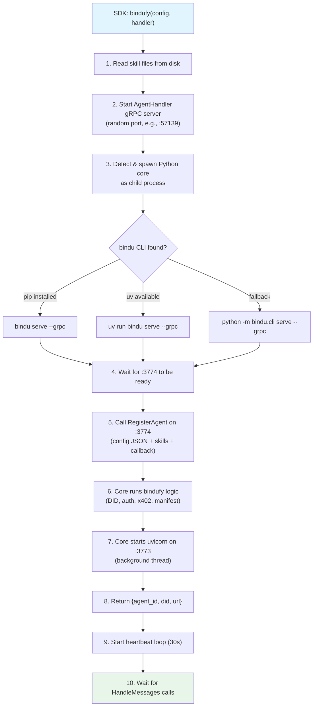

# gRPC Architecture Overview

Visual guide to how Bindu's gRPC layer works.

## Architecture Diagram



## Complete Message Flow



## SDK Internal Flow

When a developer calls `bindufy()` from a language SDK:



## Port Layout

```
Bindu Core Process
├── :3773  Uvicorn (HTTP)  — A2A protocol, agent card, DID, health, x402, metrics
└── :3774  gRPC Server     — RegisterAgent, Heartbeat, UnregisterAgent

SDK Process
└── :XXXXX  gRPC Server (dynamic port) — HandleMessages, GetCapabilities, HealthCheck
```

## Two-Way Communication

The gRPC layer enables **bidirectional** communication:

**SDK → Core (BinduService)**
- Register agent
- Send heartbeats
- Unregister

**Core → SDK (AgentHandler)**
- Execute handler
- Query capabilities
- Health check

This is different from traditional HTTP where only the client initiates requests. With gRPC, both sides can initiate calls.

## Key Components

### 1. GrpcAgentClient (Core Side)

Replaces `manifest.run` for remote agents. When ManifestWorker calls it:

```python
# In ManifestWorker
raw_results = self.manifest.run(message_history)

# For gRPC agents, this becomes:
# 1. Convert messages to proto
# 2. Call SDK's HandleMessages via gRPC
# 3. Convert response back to Python
# 4. Return to ManifestWorker
```

### 2. AgentRegistry (Core Side)

Thread-safe in-memory database tracking registered agents:

```python
registry.register(agent_id, callback_address, manifest)
entry = registry.get(agent_id)
# entry.grpc_callback_address → where to call SDK
```

### 3. BinduServiceImpl (Core Side)

Handles SDK registration requests:

```python
def RegisterAgent(self, request, context):
    # 1. Parse config JSON
    # 2. Run full bindufy logic
    # 3. Create GrpcAgentClient
    # 4. Start HTTP server
    # 5. Return agent_id, DID, URL
```

### 4. SDK AgentHandler (SDK Side)

Receives execution requests from core:

```typescript
// TypeScript SDK
async function HandleMessages(request: HandleRequest): Promise<HandleResponse> {
  const messages = request.messages;
  const result = await developerHandler(messages);
  return { content: result };
}
```

## Data Flow Example

**User sends message to agent:**

```
1. External Client
   ↓ HTTP POST / (A2A message/send)
2. Bindu HTTP Server (:3773)
   ↓ TaskManager.send_message()
3. ManifestWorker
   ↓ manifest.run(messages)
4. GrpcAgentClient
   ↓ gRPC HandleMessages(messages)
5. SDK AgentHandler (:50052)
   ↓ developerHandler(messages)
6. Developer's Code
   ↓ return "response"
7. SDK AgentHandler
   ↓ HandleResponse{content: "response"}
8. GrpcAgentClient
   ↓ return "response"
9. ManifestWorker
   ↓ ResultProcessor → ResponseDetector
10. Bindu HTTP Server
    ↓ A2A JSON-RPC response
11. External Client
```

## Comparison: Python vs gRPC Agents

| Aspect | Python Agent | gRPC Agent |
|--------|-------------|------------|
| **Process** | Single Python process | Two processes (Core + SDK) |
| **Communication** | In-process function call | gRPC over localhost |
| **Latency** | ~0ms | ~1-5ms |
| **Language** | Python only | Any language |
| **Setup** | `bindufy(config, handler)` | SDK spawns core as child |
| **Debugging** | Python debugger | Requires gRPC tools |
| **Streaming** | ✅ Supported | ❌ Not implemented |

## Why This Architecture?

**Benefits:**
- **Language agnostic** - Write agents in any language
- **Zero changes** to core - ManifestWorker doesn't know about gRPC
- **Transparent** - Developers just call `bindufy()`
- **Full feature parity** - DID, x402, skills, auth all work

**Trade-offs:**
- Extra process overhead
- Slightly higher latency
- More complex debugging
- Streaming not yet implemented
